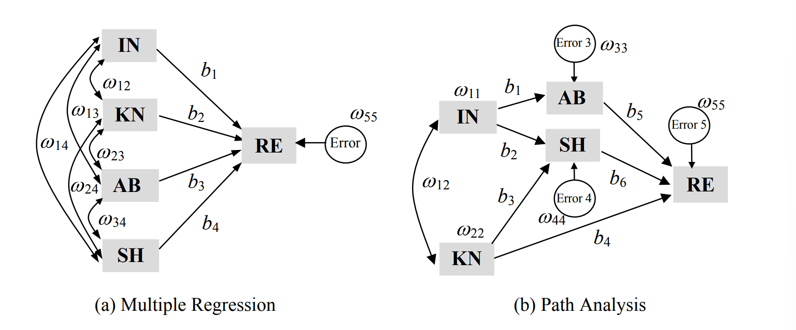

## Path Analysis
Multiple regression model and an example of path analysis models is illustrated below

Regression analysis is based on the causal model with multiple causes and a single result. But, other causal models may better describe the relationship of variables, e.g., (b). These causal relationships are expressed as a set of regression analysis models:

$$
\begin{equation*}
    \mathcal{AB}=b_1 \times \mathcal{IN} + c_3 + \epsilon_3 \\
    \mathcal{SH}=b_2 \times \mathcal{IN} + b_2 \times \mathcal{KN} + c_4 + \epsilon_4 \\
    \mathcal{RE}=b_4 \times \mathcal{KN} + b_5 \times \mathcal{AB} + b_6 \times \mathcal{SH} + c_5 + \epsilon_5
\end{equation*}
$$

 Parameters $$b_1, \dots, b_6$$ are **path coefficients**; $$c_j, \epsilon_j$$ are intercepts and errors, respectively.

In path analysis, variables are classified as explanatory and dependent variables:

- An ***explanatory variable*** is one to which no single-headed arrow extend in a path diagram; in (b), IN and KN are explanatory variables. The errors are also included as explanatory variables
- A ***dependent variable*** is one to which at least a single-headed arrow extends; AB, SH, and RE are dependent variables in (b)

### Matrix Expression

Summarizing three equation above using matrices and vectors:

$$
\begin{bmatrix}
    IN \\
    KN \\
    AB \\
    SH \\
    RE
\end{bmatrix}=
\begin{bmatrix}
    0 & 0 & 0 & 0 & 0 \\
    0 & 0 & 0 & 0 & 0 \\
    b_1 & 0 & 0 & 0 & 0\\
    b_2 & b_3 & 0 & 0 & 0 \\
    0 & b_4 & b_5 & b_6 & 0
\end{bmatrix}
\begin{bmatrix}
    IN \\
    KN \\
    AB \\
    SH \\
    RE
\end{bmatrix}+
\begin{bmatrix}
    IN \\
    KN \\
    \epsilon_3 \\
    \epsilon_4 \\
    \epsilon_5
\end{bmatrix}
$$

Any model for path analysis can be expressed in the form of

$$
\tag{1}
\vec{x}=\mathbb{B}\vec{x}+\vec{u}
$$

where

-  a (px1) is a random vector x for p variables
-  B is the (pxp) **path coefficient matrix**

rewrite (1)

$$
\begin{equation}
    \vec{x}-\mathbb{B}\vec{x}=\vec{u} \Rightarrow \\
    \vec{u}=(\mathbb{I_p-B})\vec{x} \Rightarrow \\
    \vec{x}=(\mathbb{I_p-B})^{-1}\vec{u}
\end{equation}
$$

provided the matrix $$\mathbb{I_p-B}$$ is invertable. 

### Distribution Assumptions

Assume the explanatory variable vector $$\vec{u}$$ follows MVN with mean 0 and covariance matrix:

$$
\vec{u} \sim N_p(\vec{0_p}, \mathbb{\Sigma})
$$

